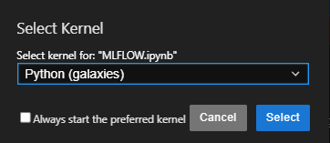

# GalaxiesML Examples

GalaxiesML is a dataset for use in machine learning in astronomy. This repository contains an example of how the GalaxiesML dataset can be used. 

The dataset is publicly available on **Zenodo** with the DOI: **[10.5281/zenodo.11117528](https://doi.org/10.5281/zenodo.11117528)**.

# CNN with MLFlow using GalaxiesML
- Below is an MLflow-integrated CNN that leverages GalaxiesML’s multi-filter galaxy images alongside structural features to estimate photometric redshift.

# Table of Contents

  - [System Requirements](#system-requirements)
  - [Training Configuration](#training-configuration)
  - [Evaluation/Inference Configuration](#evaluationinference-configuration)
  - [Prerequisites](#prerequisites)
  - [Dataset Download](#dataset-download)
      
  - [Windows Instructions](#windows-instructions)
    1. [Clone the GitHub Repository](#1-clone-the-github-repository)
    2. [Install Miniconda](#2-install-miniconda)
    3. [Create Miniconda Environment](#3-miniconda-environment-creation)
    4. [Activate Environment and Install CUDA](#4-miniconda-environment-activationcuda-installation)
    5. [Install Dependencies](#5-install-dependencies)
    6. [Configure Training File](#6-configure-training-file)
    7. [Run the Training Script](#7-run-the-training-script)\
    8. [Exploring Your Model Results with MLflow](#8-exploring-your-model-results-with-mlflow)

  - [Linux Instructions](#linux-instructions)
    1. [Install Miniconda](#installing-miniconda)
    2. [Clone the Repository](#cloning-the-repository)
    3. [Install Requirements](#installing-requirements)
    4. [Train the CNN](#training-the-cnn)
    5. [Explore Model Performance with MLflow](#explore-model-performance-with-mlflow)


> **Disclaimer**: These instructions are designed for Windows and Linux, this code is incompatible with MAC.

### System Requirements
```
| Component | Requirement                                     |
|-----------|------------------------------------------------|
| OS        | Windows 10/11 64-bit or Linux (Ubuntu 20.04+)                           |
```

### Training Configuration

#### Minimum Hardware Specifications
```
| Component | Requirement                                     |
|-----------|------------------------------------------------|
| GPU       | NVIDIA GPU with 8GB VRAM (GTX 1070 or better)  |
| CPU       | Quad-core processor (Intel i5/AMD Ryzen 5)     |
| RAM       | 8GB DDR4 (16GB recommended)                    |
```

#### Recommended Hardware Specifications
```
| Component | Requirement                                     |
|-----------|------------------------------------------------|
| GPU       | NVIDIA GPU with 12GB+ VRAM (RTX 3060 Ti+)      |
| CPU       | 6+ core processor (Intel i7/AMD Ryzen 7)       |
| RAM       | 16GB DDR4                                      |
```

### Evaluation/Inference Configuration
```
| Component | Requirement                                     |
|-----------|------------------------------------------------|
| GPU       | NVIDIA GPU with 6GB+ VRAM                      |
| CPU       | Quad-core processor (Intel i5/AMD Ryzen 5)     |
| RAM       | 8GB DDR4                                       |
```

> **Note**: The application uses GPU memory management and data generators to optimize resource utilization. Performance may vary based on specific hardware configurations and concurrent system load. 

## Dataset Download

You will need do download the datasets from the link above (5x127x127 or 5x64x64):

- 5x64x64_training_with_morphology.hdf5
- 5x64x64_validation_with_morphology.hdf5
- 5x64x64_testing_with_morphology.hdf5
 
# Windows Instructions:

## **Prerequisites**:

- Visual Studio Code installed
- GIT installed

# 0. **Install GIT**

   You will need to install GIT. You can install it using Windows Package Manager from within any terminal (CMD, Git Bash, Powershell, etc):

 ```
 winget install Git.Git
 ```
Afterward check if it has been successfully installed using the command 
```
git --version
```


 

# 1. **Clone the Github repository**

Clone the Github Repository into Visual Studio Code:

1. Copy the HTTPS link from the GitHub

   

2. Launch Visual Studio Code and select "Clone Git Repository"

   

3. Paste the HTTPS link into the bar and press enter 

   

4. Select a directory for the cloned repo to go in 

5. Select "open" when this prompt appears

   

6. Select "Yes, I trust the authors" 

   

# 2. **Install Miniconda**

Miniconda is a lightweight distribution of Conda, a package manager, and environment manager designed for Python and other programming languages. You will need to install Miniconda for Python 3.10.

1. Visit the download archive: https://repo.anaconda.com/miniconda/
2. Find the installer: "Miniconda3-py310_24.9.2-0-Windows-x86_64.exe	83.3M	2024-10-23 02:24:15" 
   - You can use CTRL+F to search for this exact filename
3. Download and run the installer
   - Leave everything unchecked except for "create shortcuts"
   - Optional: Select "Add Miniconda to my PATH Environment Variable" for convenience (however this may create conflicts with other Python versions)
   - Optional: Select "Clear the package cache upon completion" if low on disk space


# 3. **Miniconda Environment Creation**

1. Open a new CMD terminal in VS Code:

   

2. If it shows "powershell" instead of "cmd":

   

3. Create a new cmd terminal:

   

4. Ensure "cmd" is selected:

   

Your terminal should look like this:


Not like this (Powershell):


5. Create the environment by typing:
   ```
   C:\Users\<username>\miniconda3\Scripts\conda.exe create -n tf210 python=3.10
   ```
   - Replace "<username>" with your actual username on your system
   - Adjust path if Miniconda is installed elsewhere

6. Type "y" when prompted:

   

# 4. **Miniconda Environment Activation/CUDA Installation**

1. Open Command Palette (CTRL + SHIFT + P)
2. Type "Python: Select Interpreter" and select Python 3.10.16 (tf210)

   

3. Open a new CMD terminal - you should see (tf210) in the path:

   

4. If (tf210) is not visible, manually activate:
   ```
   conda activate tf210
   ```
   or
   ```
   C:\Users\<username>\miniconda3\Scripts\conda.exe activate tf210
   ```

5. Install CUDA and cuDNN:
   ```
   conda install -c conda-forge cudatoolkit=11.2 cudnn=8.1
   ```

6. Type "y" when prompted:

   

# 5. **Install Dependencies**

1. Install requirements:
   Make sure pip is installed in your conda environment:
   ```
   conda install pip
   ```
    
   Install requirements:
   
   ```
   pip install -r requirements.txt
   ```
   

3. Verify CUDA installation:
   ```
   python -c "import tensorflow as tf; print(tf.config.list_physical_devices('GPU'))"
   ```

   Successful output should look like:

   

   *Note: An empty list ([]) indicates TensorFlow is not detecting the GPU.*

# 6. **Configure Training File**

1. Open the MLFLOW.ipynb file
2. Update the dataset paths to where you installed them, for example:

   

3. Save the file (CTRL + S)

# 7. **Run the Training Script**

1. Navigate to the MLFLOW.ipynb and run each cell

2. Troubleshooting:
   If when you try to execute the cells a popup like this appears: 

   
   
   That means that you do not have the required VSCode extensions installed. 

   * Select "Browse marketplace for kernel extensions"
   * Then install "Jupyter" (By Microsoft)

   

   
   *  Now go back to the notebook and try to run the cells again, and then select "Python Environments" when this pops up

   

   * Finally, select the environment you created earlier (example: tf210)

   

   * Note: If Windows firewall gives you a warning, select "allow all access"

### Training Parameters:
- **--image_size**: Set to 64 or 127 depending on the dataset you downloaded
- **--epochs**: Number of training epochs (default: 200)
- **--batch_size**: Number of samples per training batch (default: 256)
- **--learning_rate**: Learning rate for training (default: 0.0001)

Training progress will be displayed in the notebook as well as loss values and other metrics. Checkpoints will be saved automatically during training. You can run the notebook as many times as you'd like with various parameters.

# 8. **Exploring Your Model Results with MLflow**
After training completes, run the "MLflow UI Startup Helper" cell to generate interactive links to the MLflow dashboard. Simply click the most appropriate link for your environment (typically the localhost option) to launch the visualization interface.
The MLflow dashboard provides:

* Comprehensive model performance metrics and comparisons
* Interactive visualizations of training curves
* Access to model artifacts and parameters
* Side-by-side evaluation of different training runs

This powerful interface lets you analyze your model's behavior, identify improvement opportunities, and select the best performing version for redshift estimation.


# Linux instructions:

## Open Terminal
* Press Ctrl + Alt + T to open a terminal window

* Or find "Terminal" in your system's application menu

## Install Git
First, we'll install Git:

```
sudo apt update
```

```
sudo apt install git
```

```
git --version  
```
(verify it has installed successfully)

## Check/install GPU drivers

*	Next, check if you have the required NVIDIA drivers installed:

```
nvidia-smi
```

You should see something like this:


This shows your GPU information. If you see this and you see a driver verion greater than 450.80.02, you can skip the following steps. 

* If you don’t see something similar to the above image you’ll need to install NVIDIA drivers: 

```
sudo apt update
```
```
sudo apt install nvidia-driver-535
```
**Note:** Depending on your GPU model and Linux distribution, you might need a different driver version. You can check available versions with:
```
ubuntu-drivers devices
```
**Note:** For compatibility with CUDA 11.2 and TensorFlow 2.10, you need a NVIDIA driver version at least greater than 450.80.02.  


## Installing Miniconda:

* Create/navigate to a directory for your miniconda installation
*Example:*

```
mkdir ~/CNNSoftware
```
```
cd ~/CNNSoftware
```
* Install Miniconda:

```
wget https://repo.anaconda.com/miniconda/Miniconda3-py310_24.9.2-0-Linux-x86_64.sh

```
```
chmod +x Miniconda3-py310_24.9.2-0-Linux-x86_64.sh
```
```
./Miniconda3-py310_24.9.2-0-Linux-x86_64.sh -u

```
* Press enter when prompted (hold enter key to scroll through terms and conditions)


 

* When you get to the end type “yes” and press enter when prompted


It will say something like: 

"Confirm the installation location: 

Miniconda3 will now be installed into this location:
/home/username/miniconda3

  - Press ENTER to confirm the location
  - Press CTRL-C to abort the installation
  - Or specify a different location below

"

* As the message indicates, you can choose to paste a separate path or press enter to confirm the current default installation location. Type the full path to the directory you made earlier (CNNSoftware)
 
* Once it is done it should say: 
```
   Preparing transaction: done

   Executing transaction: done
   
   installation finished.

   Do you wish to update your shell profile to automatically initialize conda?
   This will activate conda on startup and change the command prompt when activated.

   If you'd prefer that conda's base environment not be activated on startup,
      run the following command when conda is activated:

   conda config --set auto_activate_base false

   You can undo this by running `conda init --reverse $SHELL`? [yes|no]
```
* When prompted, type “yes” into the terminal. 
 
 


* It should now say “Thank you for installing Miniconda3!” 

* Close and reopen the terminal
 
* Verify Miniconda has been successfully installed by typing the command:
```
conda --version
```

* You should see a version number like “conda 24.9.2” which indicates Miniconda has been successfully installed


## Cloning the Repository
* Now we need to clone the GitHub repo

* Cd out of CNNSoftware 
```
cd ..
 
```

* Next, type git clone (HTTPS link to repo) for example: 
```
git clone https://github.com/Jacob489/MLFlow-CNN.git
```
* Then navigate into the newly created folder containing the repo files

```
cd MLFlow-CNN
```

## Installing Requirements

* Next we need to create a conda environment with all install necessary requirements installed. To do this

Type:
```
conda install mamba -n base -c conda-forge

```
(type y when prompted)

Then:
```
mamba env create --file environment.yml
```
(type y when prompted)

* Now we must activate the environment

Type:
```
conda activate galaxies
```


* You should now see “galaxies” in front of your terminal, indicating the environment has been successfully activated 

*Example:*


``` 
conda list | grep -E "cudatoolkit|cudnn"
```
which should return the CUDA and cuDNN versions.

* Now verify that Tensorflow is working correctly
```
 python -c "import tensorflow as tf; print(tf.__version__)"
 ```
* This should return "2.10.1"

* Next we need to verify that CUDA is properly configured 

Type: 

``` 
python -c "import tensorflow as tf; print(tf.config.list_physical_devices('GPU'))"
```
It should return a message that looks something like this: 


If you just have empty brackets "[ ]" it indicated Cuda has not been successfully installed/configured

## Training the CNN
 
 * Now it is time to create a Python kernel for our galaxies environment. Make sure you have ipykernel installed in that enviornment. Type:
 
 ``` 
 pip install ipykernel 
 ```
 

 Then register a new kernel for the environment:

 
```
python -m ipykernel install --user --name galaxies --display-name "Python (galaxies)"
```
This will register a new kernel called "Python (galaxies)" that you can select when launching a notebook in Jupyter. 

* Shut down all jupyter kernels and restart, and then you should see "galaxies" listed as an option in the kernel list 




Now you will need to adjust the paths in the MLFLOW.ipynb notebook to where you have installed the datasets, for example:

 

* You can also adjust hyperparameters within the notebook if you wish, however this is optional

### Training Parameters:
- **--image_size**: Set to 64 or 127 depending on the dataset you downloaded
- **--epochs**: Number of training epochs (default: 200)
- **--batch_size**: Number of samples per training batch (default: 256)
- **--learning_rate**: Learning rate for training (default: 0.0001)

 * Save the file, then run each cell in the notebook.
 
Training progress will be displayed, and once training is complete you can optionally run the notebook again with different parameters to compare performance across different runs. 

## Explore Model Performance with MLFlow

 When you are ready to evaluate the performance of the model, run the "MLflow UI Startup Helper" cell to generate interactive links to the MLflow dashboard. Simply click the most appropriate link for your environment (typically the localhost option) to launch the visualization interface.

The MLflow dashboard provides:

* Comprehensive model performance metrics and comparisons
* Interactive visualizations of training curves
* Access to model artifacts and parameters
* Side-by-side evaluation of different training runs

This powerful interface lets you analyze your model's behavior, identify improvement opportunities, and select the best performing version for redshift estimation.
